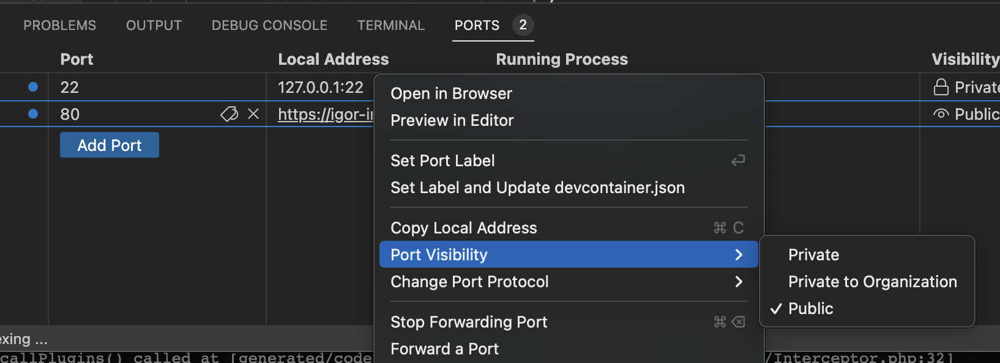

# Magento Codespaces Example

This repository provides a ready-to-use GitHub Codespaces configuration for Adobe Commerce/Magento 2 development. It includes pre-configured environments for standard development, xDebug debugging, and Blackfire profiling.


## :cloud: What is GitHub Codespaces?

GitHub Codespaces is a cloud-based development environment that allows developers to code, test, and debug applications directly from their browser. It provides a fully configured development environment in the cloud, eliminating the need for local setup and configuration.

Key features of GitHub Codespaces include:

- **Instant Development Environment**: Spin up a new development environment in seconds, without any local setup.
- **Consistent Environments**: Every team member works in identical environments, eliminating "it works on my machine" issues.
- **Powerful Resources**: Access to powerful cloud-based computing resources, regardless of your local machine's capabilities.
- **Integrated with GitHub**: Seamless integration with GitHub repositories, pull requests, and code reviews.
- **Customizable**: Fully customizable development environments using devcontainer.json and Docker configurations.

In summary, developers can easily stand-up new development environments based on pre-created templates/cellphone with Visual Studio Code in the browser, meaning they can use any device to write code, even a tablet or smartphone.


## :rocket: Why GitHub Codespaces is Better Than Traditional Docker Environments

While Docker has revolutionized development environments, GitHub Codespaces offers several advantages:

1. **Zero Local Setup**: No need to install Docker, Docker Compose, or manage container configurations locally.
2. **Reduced Resource Consumption**: No containers running on your local machine means better performance and battery life.
3. **Consistent Performance**: Cloud-based resources provide consistent performance regardless of your local hardware.
4. **Simplified Onboarding**: New team members can start contributing immediately without complex environment setup.
5. **Integrated Development Experience**: Seamless integration with GitHub and VS Code provides a unified workflow.
6. **Automatic Port Forwarding**: Easily access web applications and services running in your Codespace.
7. **Persistent Environments**: Your development environment persists between sessions, maintaining your workspace state.
8. **Scalable Resources**: Easily adjust computing resources based on project needs.
9. **Cross-Platform Compatibility**: Work from any operating system with a web browser, including mobile devices.
10. **Reduced Maintenance**: No need to maintain Docker installations or troubleshoot container issues.


## :package: Container Images

This Codespaces environment uses container images created and managed by the [Imagination Media Magento Kubernetes repository](https://github.com/Imagination-Media/magento-k8s). These images are specifically optimized for Magento/Adobe Commerce development and include all necessary tools and extensions.

### Supported PHP Versions

The following PHP versions are supported:

- PHP 7.1
- PHP 7.2
- PHP 7.3
- PHP 7.4
- PHP 8.1
- PHP 8.2
- PHP 8.4

Each PHP version is available in both AMD64 and ARM64 architectures, ensuring compatibility with various development environments.


## :gear: Environment Configurations

This repository includes three different environment configurations:

1. **Standard Environment**: Default configuration for general development work.
2. **xDebug Environment**: Configured with xDebug for step-by-step debugging and code analysis.
3. **Blackfire Environment**: Set up with Blackfire for performance profiling and optimization.

You can choose the appropriate environment based on your development needs.


## :wrench: Setting Up for a Magento/Adobe Commerce Project

To use this Codespaces configuration for your Magento/Adobe Commerce project:

1. Copy the `.devcontainer` folder from this repository to your project's root directory.
2. Adjust the configuration as needed for your specific project requirements.
3. Commit and push the changes to your GitHub repository.
4. Click the "Code" button on your repository and select "Create codespace on [branch]".

That's it! GitHub will create a new Codespace with your Magento environment ready to use.

### Configuration Adjustments

You may need to adjust the following in the `devcontainer.json` file:

- Resource allocation (CPU, memory, storage)
- PHP version
- Database configuration
- Additional extensions or tools


## :bug: Configuring xDebug

xDebug is a powerful tool to debug code. It helps developers to understand where the code is going through, the variables, their types, etc.


In order to use xDebug with GitHub codespaces we first need to make sure we created an environment using the xDebug template, otherwise, it won't work (you can confirm if your environment is using xDebug by running the php -v command).

The default port set is the 9003 port as one of the forwarded ports. That's the default port for xDebug connections (check [9) GitHub Codespaces](https://imgmedia.atlassian.net/wiki/spaces/IMDOC/pages/2506588252/9+GitHub+Codespaces) | [Forwarding Ports](https://imgmedia.atlassian.net/wiki/spaces/IMDOC/pages/2510651476/xDebug)).

Once all of that is done, we just need to open Visual Studio Code, go to the "Run" option at the top, and then click on the "Add configuration" option. It will either request us to choose the programming language (in this case PHP) or will automatically open the launch config file for us.


To start to accept xDebug connections we just need to go to the Debug tab on the left of Visual Studio Code, and click on the title "Listen for Xdebug" at the top. An orange bar will show up at the bottom of the screen, indicating that VS Code is listening for any xDebug connections.

The xDebug environment comes pre-configured with the following settings:

```
xdebug.mode=debug
xdebug.client_host=host.docker.internal
xdebug.client_port=9003
xdebug.start_with_request=yes
```

To use xDebug:

1. Select the xDebug environment when creating your Codespace.
2. The VS Code xDebug extension is automatically installed and configured.
3. Set breakpoints in your code by clicking in the gutter next to line numbers.
4. Start debugging by clicking the "Run and Debug" icon in the VS Code sidebar and selecting "Listen for xDebug".
5. Execute your code (load a page in the browser) to trigger the debugger.


## :zap: Configuring Blackfire


Blackfire is a tool and a service that allows us to monitor, profile and test our applications even before it is released in production. But we can also get actionable insights to improve your code rather than spend time figuring out what's wrong. It ensures optimal performance and user experience for our web applications.

This was part of the Magento Cloud package, so all cloud customers also had Blackfire. Some of our Magento customers need performance improvements and code refactoring to make the website faster and more reliable, so that's the moment we use Blackfire.

### Using Blackfire

To use Blackfire we need to use the Blackfire template inside the codespaces configuration. It has Blackfire installed, and then, it's just a matter of setting the Blackfire keys and we are ready to go.

Then, once you have stood up the environment we can proceed with setting up the Blackfire keys. The URL [https://blackfire.io/my/environments](https://blackfire.io/my/environments) will show you what are your available environments. Inside the environment settings, you can see the "Environment Credentials" option, there you will get the server key and server ID.

Accessing the link [https://blackfire.io/docs/up-and-running/installation?action=install&mode=full&version=latest&mode=full&location=local&os=debian&language=php&agent=537692290-04e2-4400-953a-740803c2958c#install-agent-osx](https://blackfire.io/docs/up-and-running/installation?action=install&mode=full&version=latest&mode=full&location=local&os=debian&language=php&agent=537692290-04e2-4400-953a-740803c2958c#install-agent-osx), you can see the commands to set up the Blackfire server keys and also the agent key.

The server keys command will be something like this (without sudo):

```
blackfire agent:config --server-id=xxxxxxxxxx --server-token=XXXXXXXXXXXXXXXXXXXX
```

And the agent commands will be like this:

```
blackfire client:config --client-id=xxxxxxxxxxx --client-token=XXXXXXXXXXXXXXXXXXXX
```

Once both keys are set, you can initialize the blackfire agent by running:

```
blackfire agent -vvv
```

It will initialize the agent and will be ready to listen to any new connections. Once that's ready, you can use the browser plugin or any Blackfire CLI command and start to profile your application.

To use Blackfire:

1. Select the Blackfire environment when creating your Codespace.
2. Configure your Blackfire credentials in the environment variables.
3. Use the Blackfire browser extension or CLI to profile your application.

Blackfire helps identify performance bottlenecks and optimize your Magento application.


## :toolbox: Available Tools

The Codespaces environments include several tools to help with Magento development:

- **n98-magerun2**: CLI tools for Magento administration and development.
- **mage2tv-cache-clean**: File watcher that cleans Magento cache when files are modified.
- **magepack**: Tool for optimizing Magento 2 frontend performance via JavaScript bundling.
- **corediff**: Security tool by Sansec that verifies if Magento core code was modified/compromised.


## :floppy_disk: Database Setup

The environment includes a MariaDB database pre-configured for Magento. The database is initialized with the SQL dump from the `mysql-dump` directory.


## :electric_plug: Port Forwarding

The following ports are automatically forwarded:

- **80**: Web server (Nginx)
- **3306**: MariaDB
- **9200**: Elasticsearch/OpenSearch
- **15672**: RabbitMQ Management
- **8025**: MailHog (for email testing)


## :checkered_flag: Getting Started

1. Navigate to your GitHub repository
2. Click the "Code" button
3. Select the "Codespaces" tab
4. Click "Create codespace on [branch]"
5. Choose your environment configuration (standard, xDebug, or Blackfire)
6. Wait for the environment to build and start
7. Start developing!


## :arrows_clockwise: Committing Git Changes

To commit and push changes to our feature branch from our codespaces environment, we can use the source control tab from Visual Studio Code that lists all of our changes, allowing us to commit and push our changes, our event the terminal that also has GIT and will push changes to our branch.

The source control tab in VS Code provides a graphical interface for managing your Git operations:

1. Click on the Source Control icon in the left sidebar (or press Ctrl+Shift+G)
2. Review your changes in the "Changes" section
3. Hover over files and click the + icon to stage them
4. Enter a commit message in the text field at the top
5. Click the checkmark icon to commit
6. Use the "..." menu to access more Git options, including push

Alternatively, you can use Git commands in the terminal:

```bash
# Stage specific files
git add path/to/file

# Stage all changes
git add .

# Commit changes
git commit -m "Your commit message"

# Push to remote branch
git push origin your-branch-name
```


## :globe_with_meridians: Making Environment Public



Sometimes we need to make our environment public, meaning it can be accessed and tested by others, not only our GitHub user.

To do that we can right-click on the 80 port, and use the option Port Visibility > Public.

It will generate an URL for our environment, so we must set this new URL as the base URL of our environment. Once we change that we will be able to access it out of our GitHub account.

This is helpful to share the environment with the QA team, the project manager, or even the client. They can test directly in our environment.


## :electric_plug: VS Code Extensions

The Codespaces environment comes pre-configured with several VS Code extensions to enhance your Magento development experience:

- [PHP Debug](https://marketplace.visualstudio.com/items?itemName=xdebug.php-debug): Debug support for PHP with Xdebug.
- [Intelephense](https://marketplace.visualstudio.com/items?itemName=bmewburn.vscode-intelephense-client): PHP code intelligence with advanced autocompletion, refactoring, and analysis.
- [Magento 2 Snippets](https://marketplace.visualstudio.com/items?itemName=jerrylopez.magento2-snippets): Code snippets for Magento 2 development.
- [Hyvä Themes Snippets](https://marketplace.visualstudio.com/items?itemName=benoitalix.hyva-vscode-snippets): Snippets for Hyvä Themes development in Magento 2.
- [PHP CodeSniffer](https://marketplace.visualstudio.com/items?itemName=shevaua.phpcs): PHP CodeSniffer integration for VS Code to ensure code quality.
- [GitHub Copilot](https://marketplace.visualstudio.com/items?itemName=GitHub.copilot): AI-powered code suggestions to help you write code faster.

These extensions are automatically installed when you create a new Codespace, providing a ready-to-use development environment with all the tools you need for efficient Magento development.


## :books: Additional Resources

- [GitHub Codespaces Documentation](https://docs.github.com/en/codespaces)
- [VS Code Remote Development](https://code.visualstudio.com/docs/remote/remote-overview)
- [Magento DevDocs](https://devdocs.magento.com/)
- [Imagination Media Magento K8s Repository](https://github.com/Imagination-Media/magento-k8s)
